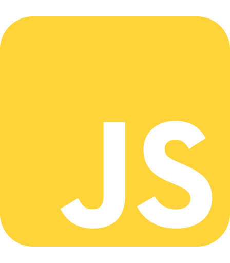

# Runtrack - B2 - PHP

    

# 📢 Contexte

Qui dit Septembre, dis rentrée ! Nous y voilà en deuxième année à La Plateforme\_.

En cette première semaine, révision des concepts en JS à travers une série d'exercices. Réactualiser des notions qui pouvaient paraître floues, se réapproprier des compétences en approfondissant ces concepts afin de coder selon les meilleures pratiques et les normes en vigueur !

Si ce dépôt a été créé pour permettre la correction des exercices par les formateurs, je profite de l'occasion pour renforcer ma mémoire musculaire des commandes de base de Git et, essentiellement, structurer ces exercices de manière à développer une documentation personnelle afin :

- d'améliorer la clarté des commentaires dans le code
- de créer des fiches pour faciliter apprentissage et révision
- d'améliorer ma compréhension des sujets traités
- d'avoir un référentiel clair et bien organisé pour l'avenir

 

PS : et puis... j'adore les Readme, tant de d'informations et de structuration possible !

 

# 💼 Structure des dossiers

- 📅 Jour-01 : Revoir les fonctions

  - 📝 Job01 : Convertir des caractères en majuscules

  - 📝 Job02 : Compter les occurences dans une chaîne de caractère

  - 📝 Job03 : Booléens - mise en abîme d'une chaîne de caractère

  - 📝 Job04 : Additionner les nombres d'un tableau

  - 📝 Job05 : Retourner les nombres premiers (limit !)

  - 📝 Job06 : Nombre² - num \* num

  - 📝 Job07 : Trouver le nombre le plus près de 0

  - 📝 Job08 : ASC et DESC des nombres d'un tableau

   

- 📅 Jour-02 :

  - 📝 Job01 : Changer le backgroundColor selon la taille de l'écran

  - 📝 Job02 : un clic, +1 !

  - 📝 Job03 : Entrée input et changement FontStyle

  - 📝 Job04 : Fetch dans MySQL, faire parler JS et PHP 

  - 📝 Job05 : en cour de réalisation
